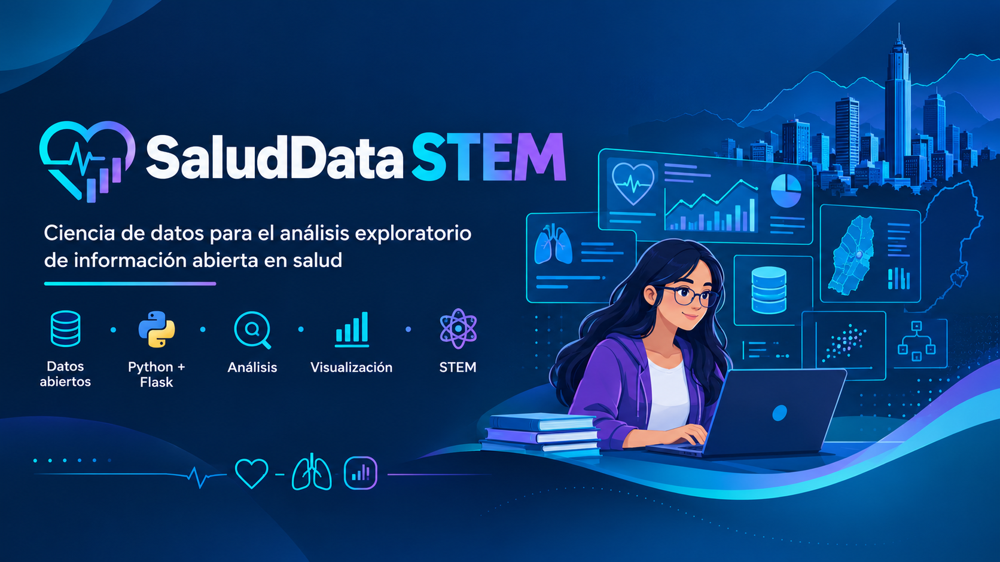

<div align="center">



<br><br>

# SaludData STEM

### Explorador interactivo de datos abiertos de salud pública

Herramienta web para consultar, validar, transformar, analizar y visualizar información abierta relacionada con salud pública mediante técnicas de ciencia de datos.

<br>

**Python · Flask · Pandas · Scikit-learn · Plotly · CKAN**

<br>
<div align="center">

[](https://saluddata-stem.onrender.com/dashboard)
[](https://github.com/leonsj12/SaludData_STEM)
[](https://www.python.org/)
[](https://flask.palletsprojects.com/)
[](#licencia)

</div>


<br>


> **Convertir datos abiertos en información comprensible, reproducible y responsable.**

</div>

---

## Índice

- [Descripción](#descripción)
- [Propósito](#propósito)
- [Características principales](#características-principales)
- [Fuentes de datos](#fuentes-de-datos)
- [Arquitectura del sistema](#arquitectura-del-sistema)
- [Tecnologías utilizadas](#tecnologías-utilizadas)
- [Estructura del proyecto](#estructura-del-proyecto)
- [Instalación](#instalación)
- [Ejecución](#ejecución)
- [Funcionamiento del dashboard](#funcionamiento-del-dashboard)
- [Análisis disponibles](#análisis-disponibles)
- [Evaluación experimental de modelos](#evaluación-experimental-de-modelos)
- [Criterios metodológicos](#criterios-metodológicos)
- [Limitaciones](#limitaciones)
- [Reproducibilidad](#reproducibilidad)
- [Proyección académica](#proyección-académica)
- [Referencias](#referencias)
- [Licencia](#licencia)

---

## Descripción

**SaludData STEM V2.3** es un prototipo funcional de análisis exploratorio de datos abiertos relacionados con la mortalidad en Bogotá D.C.

La aplicación integra un flujo completo de trabajo con datos:

```text
Adquisición
    ↓
Preparación
    ↓
Normalización
    ↓
Filtrado
    ↓
Análisis estadístico
    ↓
Análisis temporal
    ↓
Evaluación experimental
    ↓
Visualización web
